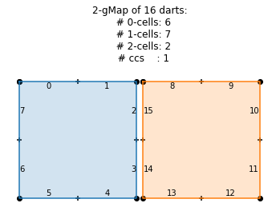
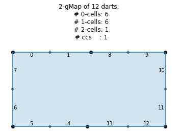
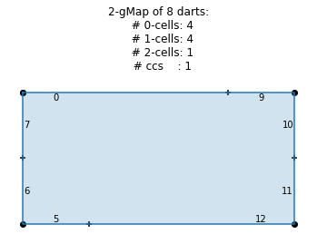
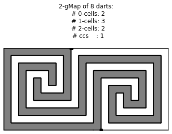

# n-Gmaps
> Implementations of gmaps in Python.


Quick start

1. git clone this repo
2. `export PYTHONPATH=$(pwd)`
3. `make` will generate the importable python files from the notebooks
3. `jupyter notebook`


## Construction of n-Gmaps

Currently there are three options to construct an n-Gmap:

1. Zoo examples. There is a collection of gmaps in `combinatorial.zoo`
1. 2D maps representing pixel R $\times$ C pixel arrays
1. 2D maps maps from labeled images, such as those found in `combinatorial.zoo_labels`

```python
from combinatorial.gmaps import nGmap
from combinatorial.zoo import G2_SQUARE_BOUNDED
```

### Constructing n-Gmaps from toy examples

see the other strings and their comment in `zoo` notebook

```python
print (G2_SQUARE_BOUNDED)   #  this is just a multi-line string
```

        1 0 3 2 5 4 7 6
        7 2 1 4 3 6 5 0
        0 1 2 3 4 5 6 7
    


```python
G = nGmap.from_string (G2_SQUARE_BOUNDED)
G
```


    2-gMap of 8 darts:
      # 0-cells: 4
      # 1-cells: 4
      # 2-cells: 1
      # ccs    : 1


```python
G.print_alpha_table()
```

    ===============================
     D# |   0  1  2  3  4  5  6  7 
    -------------------------------
     α0 |   1  0  3  2  5  4  7  6 
     α1 |   7  2  1  4  3  6  5  0 
     α2 |   0  1  2  3  4  5  6  7 
    ===============================


```python
# some members, dimension, number of darts, validity check
G.n, G.n_darts, G.is_valid
```


    (2, 8, True)


### Construction of Pixel Maps

Construct a 2-gMap that corresponds to 2D images -- either bounded or unbounded ones.
The unbounded PixelMaps have the additional background face.

```python
from combinatorial.pixelmap import PixelMap

# bounded pixel map exmple
bpm = PixelMap.from_shape(1,2)
bpm.plot_faces()
```





```python
bpm.print_alpha_table()
bpm

```

    =======================================================
     D# |   0  1  2  3  4  5  6  7  8  9 10 11 12 13 14 15 
    -------------------------------------------------------
     α0 |   1  0  3  2  5  4  7  6  9  8 11 10 13 12 15 14 
     α1 |   7  2  1  4  3  6  5  0 15 10  9 12 11 14 13  8 
     α2 |   0  1 15 14  4  5  6  7  8  9 10 11 12 13  3  2 
    =======================================================


    2-gMap of 16 darts:
      # 0-cells: 6
      # 1-cells: 7
      # 2-cells: 2
      # ccs    : 1


```python
# unbounded pixel map example
# note the extra 2-cell (background)

upm = PixelMap.from_shape(1,2, bounded=False)
upm
```


    2-gMap of 28 darts:
      # 0-cells: 6
      # 1-cells: 7
      # 2-cells: 3
      # ccs    : 1


```python
upm.print_alpha_table()
```

    ===========================================================================================
     D# |   0  1  2  3  4  5  6  7  8  9 10 11 12 13 14 15 16 17 18 19 20 21 22 23 24 25 26 27 
    -------------------------------------------------------------------------------------------
     α0 |   1  0  3  2  5  4  7  6  9  8 11 10 13 12 15 14 17 16 19 18 21 20 23 22 25 24 27 26 
     α1 |   7  2  1  4  3  6  5  0 15 10  9 12 11 14 13  8 27 18 17 20 19 22 21 24 23 26 25 16 
     α2 |  27 26 15 14 19 18 17 16 25 24 23 22 21 20  3  2  7  6  5  4 13 12 11 10  9  8  1  0 
    ===========================================================================================


## Iteration techniques


### Dart iteration

The `darts` member is a generator, so you can iterate (rather than creating unnecessary copies):

```python
for d in bpm.darts:
    print (d, end = ' ')
```

    0 1 2 3 4 5 6 7 8 9 10 11 12 13 14 15 

```python
set (bpm.darts)
```


    {0, 1, 2, 3, 4, 5, 6, 7, 8, 9, 10, 11, 12, 13, 14, 15}


### Orbit iteration = i-Cells

Similarly, orbits are generators rather than sets.

Lets have a look at 0-cells, 1-cells, and 2-cells containing dart 6.
The `cell_i` mambers are shortcuts to the `orbit` members.

```python
set (bpm.cell_0 (6)),   set (bpm.orbit ([1,2], 6))
```


    ({5, 6}, {5, 6})


```python
set (bpm.cell_1 (6)),   set (bpm.orbit ([0,2], 6))
```


    ({6, 7}, {6, 7})


```python
set (bpm.cell_2 (6)),   set (bpm.orbit ([0,1], 6))
```


    ({0, 1, 2, 3, 4, 5, 6, 7}, {0, 1, 2, 3, 4, 5, 6, 7})


## Dual

The nice feature of gMaps is that the dual has reverted the involutions.
Represented by tables, we can thus have an in-place dual view.
Similar to numpy transpose we have member `nGmap.D` to access gmap's dual.

```python
print ('Primal: ', bpm, 'Dual: ', bpm.D)

```

    Primal:  2-gMap of 16 darts:
      # 0-cells: 6
      # 1-cells: 7
      # 2-cells: 2
      # ccs    : 1
     Dual:  2-gMap of 16 darts:
      # 0-cells: 2
      # 1-cells: 7
      # 2-cells: 6
      # ccs    : 1
    


```python
print ('Involutions of the primal: ')
bpm.print_alpha_table()
print ('Involutions of the dual:')
bpm.D.print_alpha_table()
```

    Involutions of the primal: 
    =======================================================
     D# |   0  1  2  3  4  5  6  7  8  9 10 11 12 13 14 15 
    -------------------------------------------------------
     α0 |   1  0  3  2  5  4  7  6  9  8 11 10 13 12 15 14 
     α1 |   7  2  1  4  3  6  5  0 15 10  9 12 11 14 13  8 
     α2 |   0  1 15 14  4  5  6  7  8  9 10 11 12 13  3  2 
    =======================================================
    Involutions of the dual:
    =======================================================
     D# |   0  1  2  3  4  5  6  7  8  9 10 11 12 13 14 15 
    -------------------------------------------------------
     α0 |   0  1 15 14  4  5  6  7  8  9 10 11 12 13  3  2 
     α1 |   7  2  1  4  3  6  5  0 15 10  9 12 11 14 13  8 
     α2 |   1  0  3  2  5  4  7  6  9  8 11 10 13 12 15 14 
    =======================================================


## Removal and contraction

n-Gmaps allow to remove (contract) i-cells that are incident at most two i+1 (i-1) cells.
Let's remove the edge between the labels ...

```python
bpm.remove_edge(2)
bpm.print_alpha_table()
bpm.plot_faces()
```

    ===========================================
     D# |   0  1  4  5  6  7  8  9 10 11 12 13 
    -------------------------------------------
     α0 |   1  0  5  4  7  6  9  8 11 10 13 12 
     α1 |   7  8 13  6  5  0  1 10  9 12 11  4 
     α2 |   0  1  4  5  6  7  8  9 10 11 12 13 
    ===========================================





... and lets remove two vertices.
Note that the vertex containing dart 1 can be equivalently removed by contracting the corresponding face of the dual.

```python
bpm.D.contract_face(1)  #  bpm.remove_vertex(1) would do the same job
bpm.remove_vertex(4)

bpm.print_alpha_table()
bpm.plot_faces()
```

    ===============================
     D# |   0  5  6  7  9 10 11 12 
    -------------------------------
     α0 |   9 12  7  6  0 11 10  5 
     α1 |   7  6  5  0 10  9 12 11 
     α2 |   0  5  6  7  9 10 11 12 
    ===============================





## 2-gMaps from labels

3-faces spiral example.

1. Pick some label image, e.g, from `zoo_labels`
1. create a 2-gMap out of the label image
1. remove edges and vertices
1. plot it

```python
# Similar to gmap-zoo `G2_...` strings, `L2_SPIRAL_WW` is just a multi-line string.

from combinatorial.zoo_labels import L2_SPIRAL_WB, str2labels

print (L2_SPIRAL_WB)
```

    . . . . . . . . . w w w w w w w w w w w w w
    . w w w w w w w . w . . . . . . . . . . . w
    . w . . . . . w . w . w w w w w w w w w . w
    . w . w w w . w . w . w . . . . . . . w . w
    . w . w . w . w . w . w . w w w w w . w . w
    . w . w . w w w . w . w . w . . . w . w . w
    . w . w . . . . . w . w . w . w . w . w . w
    . w . w w w w w w w . w . w . w . . . w . w
    . w . . . . . . . . . w . w . w w w w w . w
    . w w w w w w w w w w w . w . . . . . . . w
    . . . . . . . . . . . . . w w w w w w w w w
    


```python
# convert the string to an RGB image

from combinatorial.pixelmap import LabelMap

image = str2labels (L2_SPIRAL_WB)
image.shape
```


    (11, 22, 3)


```python
# construct a 2-gMap out of the lables

lm_spiral = LabelMap.from_labels (image)
lm_spiral
```


    2-gMap of 1936 darts:
      # 0-cells: 276
      # 1-cells: 517
      # 2-cells: 242
      # ccs    : 1


```python
# simplify the 2-gMap

lm_spiral.remove_edges()
lm_spiral.remove_vertices()
lm_spiral
```


    2-gMap of 8 darts:
      # 0-cells: 2
      # 1-cells: 3
      # 2-cells: 2
      # ccs    : 1


```python
lm_spiral.plot(number_darts=False)
```




